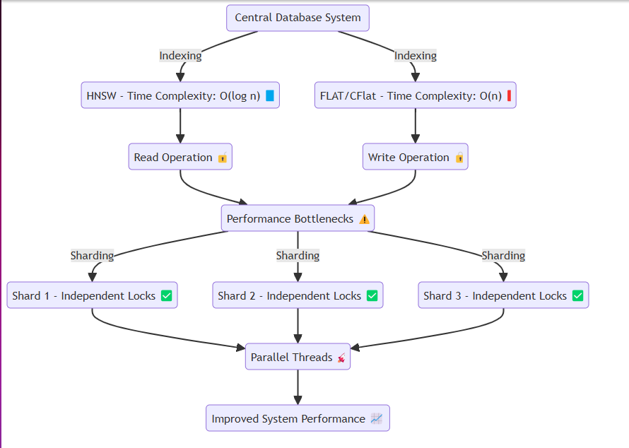
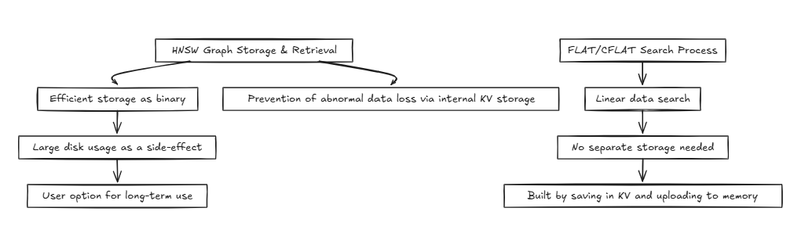
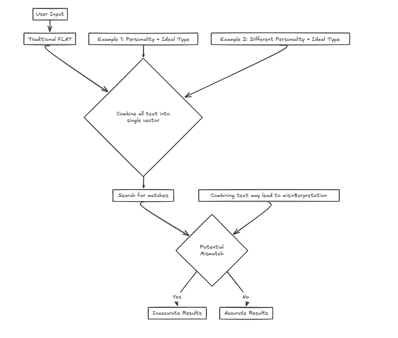
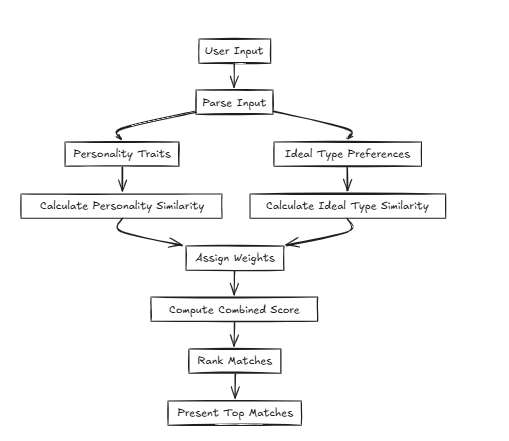
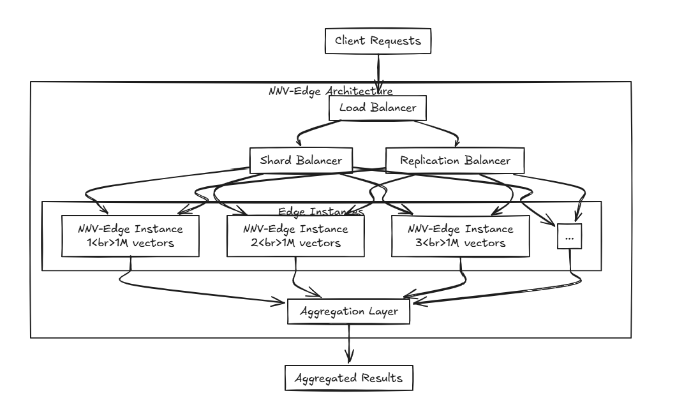

# NNV (No-Named.V)


NNV (No-Named.V) is a database designed to be implemented from scratch to production. NNV can be deployed in edge environments and used in small-scale production settings. Through the innovative architectural approach described below, it is envisioned and developed to be used reliably in large-scale production environments as well.

## 🎉 Release Update - 2024.12.26

For the full update history, see [UPDATE HISTORY](./UPDATE-LOG.md).

---

### 🔹 NNV-Edge

- **Edge Data Pattern Changes and Performance Upgrades**: Edge has now implemented the shard data pattern of HNSW (Hierarchical Navigable Small World). Additionally, it no longer retrieves data from disk, thereby reducing overhead. However, some performance is still sacrificed to accommodate metadata changes, and there are limitations due to linear search.

- **Addition of highAvailableResource Option**: This is the most critical feature of the current Edge update. To overcome the shortcomings of linear search, parallel searches per shard are supported. The primary objective of Edge is to operate on specific devices or edge environments, which experience less traffic compared to central cloud infrastructures. While parallel goroutines can cause context switching overhead under excessive traffic, in scenarios where operations need to be performed in a specific small dataset space with precision considerations, enabling this option can support faster searches. Currently, with this option disabled, searching through 1 million datasets takes approximately 0.2 to 0.3 seconds. When the option is enabled, the search time reduces to about 0.02 to 0.03 seconds.
  Similar to Milvus, which internally uses a goroutine worker pool, NNV (presumably your system) generates goroutines based on a fixed shard size. It is expected to perform well on edge environments. When operating in cloud environments, developers may need to adjust this option according to the specific environment, or alternatively, consider using NNV-Core.

---

### 🔹 NNV

- **Progress on PQ and BQ**: Continuous review of PQ and BQ is underway.
- **Integration of Existing Quantization**: Planning to proceed with quantization integration (Report work is delayed due to a heavy workload. 😢)

---

## 🚀 Update Preview

⚠️ _Expected release date is TBD. Development is ongoing, and updates will be added as we progress.(It's slow because I work in my spare time outside of work.)_ 😭

---

### 🔸 Planned Features and Improvements

- **Development of an Automated Pipeline for Building LLM Fine-Tuning Datasets** : We plan to develop a pipeline that automatically constructs datasets for future LLM (Large Language Model) fine-tuning. The characteristic of the vector database is that it performs searches based on natural language queries, and the recall dataset implies similar responses. Although immediate training is not possible through this approach, it aims to support internal experts and developers in building datasets more quickly by providing a suitable format.

- **CFLAT** : We plan to support CFLAT, which can facilitate various services through more complex operations that enable multi-vector searches.

---

### ⚠️ Important Notice

> _Performance may be temporarily reduced due to ongoing development. Thank you for your patience!_

---

### Run from the source code.

```sh
Windows & Linux
git clone https://github.com/sjy-dv/nnv
cd nnv
# start edge
go run cmd/root/main.go -mode=edge
# start core
go run cmd/root/main.go -mode=root


MacOS
**The CPU acceleration (SSE, AVX2, AVX-512) code has caused an error where it does not function on Mac, and it is not a priority to address at this time.**

git clone https://github.com/sjy-dv/nnv
cd nnv
source .env
deploy
make edge-docker
```

# Index

- [Features](#features)
- [ARCHITECTURE](#architecture)

  - [LoadBalancer&DatabaseIntegration](#loadbalancer--database-integration)
  - [InternalDataShardDesign](#sharding-design-for-internal-data)
  - [InternalDataFlow](#internal-data-flow)
  - [Multi-Vector Search](#cflat-composite-flat--multi-vector-search)
  - [When is CFLAT Used?](#when-is-cflat-used)
  - [Edge](#what-is-nnv-edge)

- [BugFix](#-bugfix)

## Features

When planning this project, I gave it a lot of thought.

When setting up the cluster environment, it's natural for most developers to choose the RAFT algorithm, as I had always done before. The reason being that it's a proven approach used by successful projects.

However, I began to wonder: isn't it a bit complex? RAFT increases read availability but decreases write availability. So, how would I solve this if multi-write becomes necessary in the long run?

Given the nature of vector databases, I assumed that most services would be structured around batch jobs rather than real-time writing. But does that mean I can just skip addressing the issue? I didn't think so. However, building a multi-leader setup on top of RAFT using something like gossip felt extremely complex and difficult.


Therefore, as of today (2024-10-20), I am considering two architectural approaches.

## ARCHITECTURE

The architecture is divided into two approaches.

### LoadBalancer & Database Integration

First, a load balancer is placed at the front, supporting both sharding and integration of the data. The internal database exists in a pure state.

|  |  |
| :-------------------------------------------: | :-------------------------------------------: |
|                  Replica LB                   |                   Shard LB                    |

The replication load balancer waits for all databases to successfully complete writes before committing or rolling back, while the shard load balancer distributes the load evenly across the shard databases to ensure similar storage capacities.

The key difference is that replication can slow down write operations but provides faster read performance in the medium to long term compared to the shard load balancer. On the other hand, the shard approach offers faster write speeds because it only commits to a specific shard, but reading requires gathering data from all shards, which is slower initially but could become faster than replication as the dataset grows.

Therefore, for managing large volumes of data, the shard balancer is slightly more recommended. However, the main point of both architectures is their simplicity in setup and management, making them as easy to handle as a typical backend server.


### JetStream(Nats) Multi-Leader


The second approach utilizes JetStream for the configuration.

While this is architecturally simpler than the previous approach, from the user's perspective, the setup is not significantly different from RAFT.

However, the key difference is that, unlike RAFT, it supports multi-write and multi-read configurations, rather than single-write and multi-read.

In this approach, the database is configured in a replication format, and JetStream is used to enable multi-leader configurations.


Each database contains its own JetStream, and these JetStreams join the same group of topics and clusters. In this case, whenever all nodes attempt to publish changes to a row, they pass through the same JetStream. If two nodes attempt to modify the same data in parallel, they will compete to publish their changes. While it's possible to prevent changes from being propagated, this could lead to data loss. According to the RAFT quorum constraint in JetStream, only one writer can publish the change. Therefore, we designed the system to allow the last writer to win. This is not an issue for vector databases because, compared to traditional databases, the data structure is simpler (this doesn't imply that the system itself is simple, but rather that there are fewer complex transactions and procedures, such as transaction serialization). This also avoids global locks and performance bottlenecks.


### Summary:

1. **RAFT and Quorum Constraints**  
   RAFT is an algorithm that dictates which server writes data first. In RAFT, the concept of a **quorum** refers to the minimum number of servers required to confirm data before it's written. This ensures that even if two servers try to write data simultaneously, RAFT allows only one server to write first.
2. **Last Writer Wins**  
   Even if one server writes data first, the server that writes last ultimately "wins." This means that the data from the last server to write will overwrite the previous server’s data.
3. **Transaction Serialization Concerns**  
   Transaction serialization refers to ensuring that consistent actions occur across multiple tables. In NNV, to improve performance, global locking (locking all servers before writing data) is avoided. Instead, when multiple servers modify data simultaneously, the last one to modify it will win. This approach is feasible because vector databases are simpler than traditional databases—they don’t require complex transaction serialization across multiple tables or collections.
4. **Why This Design?**  
   The primary reason is performance. Locking all servers before processing data is safe but slow. Instead, allowing each server to freely modify data and accepting the last modification as the final result is faster and more efficient.

### Old Architecture(~2024.12.09)

[View Old Architecture](./examples/old_architecture.md)

### Sharding Design for Internal Data


Typically, systems like databases access the same memory or disk, repeatedly performing read and write operations. In this process, methods like HNSW can achieve efficient time complexities such as **O(log n)**. However, techniques that require accuracy, such as FLAT and CFlat, generally execute linear searches with a time complexity of **O(n)**.

The problem arises when avoiding data contention. When reading or writing, threads like goroutines isolate the respective resources through locks. Specifically:

- **Reading**: Access to locked resources is permitted.
- **Writing**: Access to locked resources is restricted, preventing reads during write operations.
  When inserting large volumes of data or handling numerous read requests that require writing, performance bottlenecks gradually emerge.

To address this, we have designed the system to efficiently create shards in memory and assign data to each shard without losing the essence of the system. Each shard features a locking mechanism that allows for:

**Faster Lock Release**: When inserting large amounts of data or performing read operations.
**Partitioned Data Insertion**: Facilitating smooth system operations by allowing data to be inserted into divided segments.
This design ensures that the system can operate seamlessly even under heavy data insertion or high read request scenarios, thereby mitigating performance bottlenecks.

### Internal Data Flow



**HNSW (Hierarchical Navigable Small World):**

- **Graph Storage**: Recreating the graph every time is inefficient; therefore, the graph is stored lightly in a binary format.
- **Data Redundancy**: Simultaneously stored in the internal key-value (KV) store to prevent abnormal data loss.
- **Disk Usage**: However, this approach results in relatively high disk usage, making it an option that users will choose in the long term.

**FLAT/CFLAT(Composite FLAT):**

- **Data Search**: Since data search is inherently linear, it is not stored separately.
- **Data Handling**: Built using a method where data is stored in the KV store and then uploaded to memory.

### CFLAT (Composite FLAT) : Multi-Vector Search

**CFLAT (Composite FLAT)** is an indexing method that searches multiple vectors and produces composite results based on the importance of two vectors.

Applying composite vector search to graph algorithms like HNSW is challenging because it requires a significant amount of memory and does not align well with neighborhood structures, necessitating multiple graphs. Although the time complexity for search still converges to O(2 log n) ≈ O(log n), the space complexity is considerably poor.

These issues become increasingly problematic as the amount of data grows. Additionally, the method of merging and evaluating based on composite keys within the graph structure ignores topK and significantly increases the heap size for a single search.

Therefore, we have opted to process based on FLAT. Although the time complexity is O(n) (without any constant drops), the space complexity remains the same as FLAT, and it is highly effective for merging and evaluating based on composite keys.

### When is CFLAT Used?

magine we are developing a service for a matchmaking company that helps users find their ideal partners based on input criteria. We will be considering various factors such as personality and other attributes. However, using a single vector means combining these factors into one sentence for the search, which greatly increases the likelihood of accuracy distortion.

For example:

**Desired Traits: {Personality: Decisive, Ideal Type: Tall and Slim}**
In this scenario, the user prefers a personality trait that makes the ideal type someone likely to appreciate them, focusing on finding a partner based on external attributes.

However, consider another case:

**Desired Traits: {Personality: Easygoing, Ideal Type: Decisive}**
Here, someone who wants an easygoing personality paired with a decisive ideal type might result in incorrect matches, such as matching with individuals who are decisive in ways that don't align with the user's true preferences.


In such cases, CFLAT (Composite FLAT) calculates scores by jointly evaluating the similarity in personality and the similarity in the ideal type. Users can assign importance levels to each attribute, allowing higher scores to be given to the aspects with greater similarity based on user-defined priorities.

## What is NNV-Edge?

Edge refers to the ability to transmit and receive data on nearby devices without communication with a central server. However, in practice, "Edge" in software may sometimes differ from this concept, as it is often deployed in lighter, resource-constrained environments compared to a central server.

NNV-Edge is designed to operate quickly on smaller-scale vector datasets (up to 1 million vectors) in a lightweight manner, transferring automated tasks from the original NNV back to the user for greater control.

Advanced algorithms like HNSW, Faiss, and Annoy are excellent, but don’t you think they may be a bit heavy for smaller-scale specs? And setting aside algorithms, while projects like Milvus, Weaviate, and Qdrant are built by brilliant minds, aren’t they somewhat too resource-intensive to run alongside other software on small, portable devices?

That’s where NNV-Edge comes in.

What if you distribute multiple edges? By using NNV-Edge with the previously mentioned load balancer, you can create an advanced setup that shards data across multiple edges and aggregates it seamlessly!
