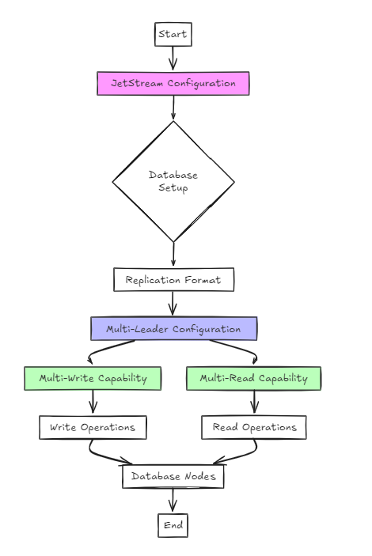

# NNV (No-Named.V)


NNV (No-Named.V) is a production database project by a developer aspiring to gain recognition. The project is designed as a KV database, aiming to support FLAT (already supported => cancel) and HNSW indexing in the long term. Bitmap-based indexing and quantization for vector indexes are supported (quantization already supported => cancel). Additionally, it aims to incorporate real-time streaming functionality to enable versatile use cases.

Additionally, its flexible and innovative cluster architecture presents a new vision.

### Release Update (2024.11.02) [UPDATE HISTORY](./UPDATE-LOG.md)

[Please also review the test results.](./examples/2024_11_02_release.md)

- Automatic indexing is supported.
  - Limitations
    - All metadata is indexed without user configuration.
    - RAM is required to maintain the index.
    - Support for various operators is limited; currently, only matching is possible.
- Searches can only be performed using filters.
- Hybrid search is supported.
  - Limitations
    - All filters must be processed as strings. For example, if age is stored as an integer (20), it must be searched using "age": "20".
    - However, this is only a restriction during searches; the actual data retains its original type.

### Update Preview

**⚠️I don't know when it will be updated. (I just want to develop 😭)**

- A process to periodically save data must be added after checking the system's idle state.
- An automatic recovery feature must be added.
- Expressions, such as various range searches, must be supported in filters.
- Benchmarking must be conducted after the system stabilizes.
- A load balancer must be developed after the system stabilizes.

### ⚠️ Warning

- It may be slow because you are not currently focused on this task.
- The hybrid search method using bitmap indexing within metadata is scheduled to be added after the initial release.

### Run from the source code.

```sh
Windows & Linux
git clone https://github.com/sjy-dv/nnv
cd nnv
go run cmd/root/main.go

MacOS
**The CPU acceleration (SSE, AVX2, AVX-512) code has caused an error where it does not function on Mac, and it is not a priority to address at this time.**

git clone https://github.com/sjy-dv/nnv
cd nnv
source .env
deploy
make simple-docker
```

# Index

- [Features](#features)
- [ARCHITECTURE](#architecture)

  - [LoadBalancer&DatabaseIntegration](#loadbalancer--database-integration)
  - [JetStream(Nats)Multi-Leader](#jetstreamnats-multi-leader)
  - [InternalDataFlow](#i-will-explain-the-internal-data-storage-flow)
  - [cache-data-is-safe?](#disk-files-can-sometimes-become-corrupted-and-fail-to-open-leading-to-significant-issues-is-cached-data-safe)

- [BugFix](#-bugfix)

## Features

When planning this project, I gave it a lot of thought.

When setting up the cluster environment, it's natural for most developers to choose the RAFT algorithm, as I had always done before. The reason being that it's a proven approach used by successful projects.

However, I began to wonder: isn't it a bit complex? RAFT increases read availability but decreases write availability. So, how would I solve this if multi-write becomes necessary in the long run?

Given the nature of vector databases, I assumed that most services would be structured around batch jobs rather than real-time writing. But does that mean I can just skip addressing the issue? I didn't think so. However, building a multi-leader setup on top of RAFT using something like gossip felt extremely complex and difficult.


Therefore, as of today (2024-10-20), I am considering two architectural approaches.

## ARCHITECTURE

The architecture is divided into two approaches.

### LoadBalancer & Database Integration

First, a load balancer is placed at the front, supporting both sharding and integration of the data. The internal database exists in a pure state.

|  |  |
| :-------------------------------------------: | :-------------------------------------------: |
|                  Replica LB                   |                   Shard LB                    |

The replication load balancer waits for all databases to successfully complete writes before committing or rolling back, while the shard load balancer distributes the load evenly across the shard databases to ensure similar storage capacities.

The key difference is that replication can slow down write operations but provides faster read performance in the medium to long term compared to the shard load balancer. On the other hand, the shard approach offers faster write speeds because it only commits to a specific shard, but reading requires gathering data from all shards, which is slower initially but could become faster than replication as the dataset grows.

Therefore, for managing large volumes of data, the shard balancer is slightly more recommended. However, the main point of both architectures is their simplicity in setup and management, making them as easy to handle as a typical backend server.


### JetStream(Nats) Multi-Leader



The second approach utilizes JetStream for the configuration.

While this is architecturally simpler than the previous approach, from the user's perspective, the setup is not significantly different from RAFT.

However, the key difference is that, unlike RAFT, it supports multi-write and multi-read configurations, rather than single-write and multi-read.

In this approach, the database is configured in a replication format, and JetStream is used to enable multi-leader configurations.


Each database contains its own JetStream, and these JetStreams join the same group of topics and clusters. In this case, whenever all nodes attempt to publish changes to a row, they pass through the same JetStream. If two nodes attempt to modify the same data in parallel, they will compete to publish their changes. While it's possible to prevent changes from being propagated, this could lead to data loss. According to the RAFT quorum constraint in JetStream, only one writer can publish the change. Therefore, we designed the system to allow the last writer to win. This is not an issue for vector databases because, compared to traditional databases, the data structure is simpler (this doesn't imply that the system itself is simple, but rather that there are fewer complex transactions and procedures, such as transaction serialization). This also avoids global locks and performance bottlenecks.


### Summary:

1. **RAFT and Quorum Constraints**  
   RAFT is an algorithm that dictates which server writes data first. In RAFT, the concept of a **quorum** refers to the minimum number of servers required to confirm data before it's written. This ensures that even if two servers try to write data simultaneously, RAFT allows only one server to write first.
2. **Last Writer Wins**  
   Even if one server writes data first, the server that writes last ultimately "wins." This means that the data from the last server to write will overwrite the previous server’s data.
3. **Transaction Serialization Concerns**  
   Transaction serialization refers to ensuring that consistent actions occur across multiple tables. In NNV, to improve performance, global locking (locking all servers before writing data) is avoided. Instead, when multiple servers modify data simultaneously, the last one to modify it will win. This approach is feasible because vector databases are simpler than traditional databases—they don’t require complex transaction serialization across multiple tables or collections.
4. **Why This Design?**  
   The primary reason is performance. Locking all servers before processing data is safe but slow. Instead, allowing each server to freely modify data and accepting the last modification as the final result is faster and more efficient.

### I will explain the internal data storage flow.


First, HNSW operates in memory internally, and its data is stored as cached files. However, this poses a risk of data corruption in the event of an abnormal shutdown.

To address this, nnlogdb (no-named-tsdb) is internally deployed to track insert, update, and delete events. Since only metadata and vectors are needed without node links, this is not a significant issue.

The observer continuously compares the tracked log values with the latest node, and if a problem arises, HNSW recovery is initiated.

### Disk files can sometimes become corrupted and fail to open, leading to significant issues. Is cached data safe?


Cache data files support fast loading and saving through the INFLATE/DEFLATE compression algorithm. However, cache files are inherently much less stable than disk files.

To address this, we deploy "old" versions. These versions are not user-specified; instead, they are managed internally. During idle periods, data changes are saved as new cache data, while the previous stable open file version is stored as the "old" version. When this happens, the last update time of the "old" version aligns with the sync time in nnlogdb.

To manage disk usage efficiently, all previous partitions up to the reliably synced period are deleted.

This approach ensures stable data management.

### The private ID and node ID are different, so how do you find them? Do you load them into memory?


The private ID and node ID can differ and are treated separately in NNV. Loading them into memory is not efficient.

Since we support internal KV storage, we store the node ID as the value with the private ID as the key. This allows us to update or delete the desired key based on user requests.

### The node link structure and the order of the graph in HNSW are crucial, and any deviation could significantly reduce accuracy. Despite this, is safe recovery still possible?

#### Simulation

```sh
Step 1: Initial State (Empty Graph)

[ ]   [ ]   [ ]   [ ]   [ ]   [ ]   [ ]   [ ]   [ ]   [ ]
 |     |     |     |     |     |     |     |     |     |
( )   ( )   ( )   ( )   ( )   ( )   ( )   ( )   ( )   ( )

Explanation:
- Each `[ ]` represents an empty node.
- The `( )` below each node symbolizes potential links to other nodes (currently empty).

Step 2: Insert '1 aaaa'

[1:aaaa]   [ ]   [ ]   [ ]   [ ]   [ ]   [ ]   [ ]   [ ]   [ ]
     |
   ( )

Explanation:
- Data `'aaaa'` with ID `1` is inserted into the first empty node.
- Links `( )` are established according to the HNSW algorithm.

Step 3: Update '1 aaaa' to '1 bbbb' (Delete + Insert)

Delete '1 aaaa':
[ ]   [ ]   [ ]   [ ]   [ ]   [ ]   [ ]   [ ]   [ ]   [ ]
 |
( )

Explanation:
- The data `'aaaa'` is deleted from node `1`, leaving it empty.
- This action is logged as `{delete-event, 1, aaaa}`.

Insert '1 bbbb':

[1:bbbb]   [ ]   [ ]   [ ]   [ ]   [ ]   [ ]   [ ]   [ ]   [ ]
     |
   ( )

Explanation:
- New data `'bbbb'` is inserted into node `1`.
- This action is logged as `{insert-event, 1, bbbb}`.
- Links are re-established as necessary.

Step 4: Recovery Process

During recovery, we start with all nodes empty and replay the logs in order:

Insert '1 aaaa':
Node 1 now contains 'aaaa'.
Delete '1 aaaa':
Node 1 is emptied.
Insert '1 bbbb':
Node 1 now contains 'bbbb'.

[1:bbbb]   [ ]   [ ]   [ ]   [ ]   [ ]   [ ]   [ ]   [ ]   [ ]
     |
   ( )

Explanation:
- Node `1` contains the updated data `'bbbb'`.
- The graph's structure and links are restored accordingly.

```

#### Understanding the Update Process

- Update as Delete + Insert:
  - An update operation replaces old data with new data.
  - We handle this by first deleting the old data ('aaaa') and then inserting the new data ('bbbb').
  - This method simplifies the logging to just insert and delete events.

#### Recovery Mechanics

- Starting from Empty Nodes:

  - Recovery begins with all nodes in an empty state.
  - This approach avoids dependencies on previous node states or positions.

- Applying Logs Sequentially:
  - Logs are replayed in the exact order they were recorded.
  - Each log entry modifies the graph incrementally, ensuring consistency.

#### Graph Structure Maintenance

- Node IDs and Links:

  - Each node has a unique ID (e.g., 1).
  - Links between nodes are managed according to the HNSW algorithm during inserts.

- Handling Empty Nodes:
  - Empty nodes are available for new data insertions.
  - The algorithm ensures that the graph remains navigable even as nodes are added or removed.

### 🐛 BugFix
