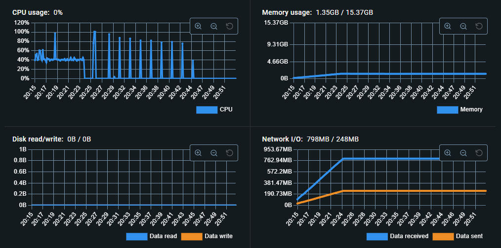

# NNV Compare Milvus(The most famous vector DB)

## Resources when inserting a million vectors

### Milvus

### NNV (Only Memory Before GC) - (Before Performance Upgrade)

### After GC - (Before Performance Upgrade)

### NNV - (Performance Upgrade)

## Insert Compare (Before Performance Upgrade VS Performance Upgrade)

- Memory is the fastest but has lower data safety and is very expensive.

## NNV Compare Milvus Insert

- This is simply a difference in insertion speed, and Milvus is still actually 10 times faster. While insertion time can be important, Milvus has many internal compression processes, so this is just a simple metric and does not indicate software superiority.
- Additionally, Milvus supports batch insertion, which has not been tested.
